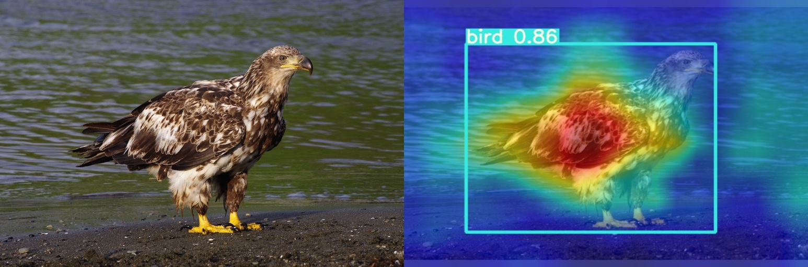
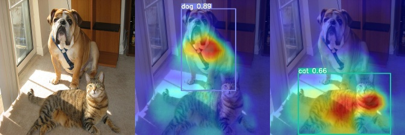
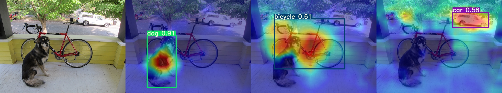

# yolov5-6.1-GradCAM

#### 介绍
在YOLOv5-6.1版本中，中实现GradCAM/GradCAM++可视化

具体实现部分可见CSDN博客：[【YOLOv5】结合GradCAM热力图可视化](https://blog.csdn.net/weixin_43799388/article/details/126207632)

#### 运行
GradCAM
```bash
python main_gradcam.py --method gradcam
```

GradCAM++
```bash
python main_gradcam.py --method gradcampp
```

#### 结果
GradCAM



&nbsp;


&nbsp;



&nbsp;
GradCAM++(待更新...)


#### 参考
https://github.com/pooya-mohammadi/yolov5-gradcam